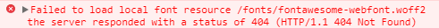
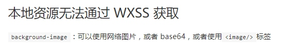
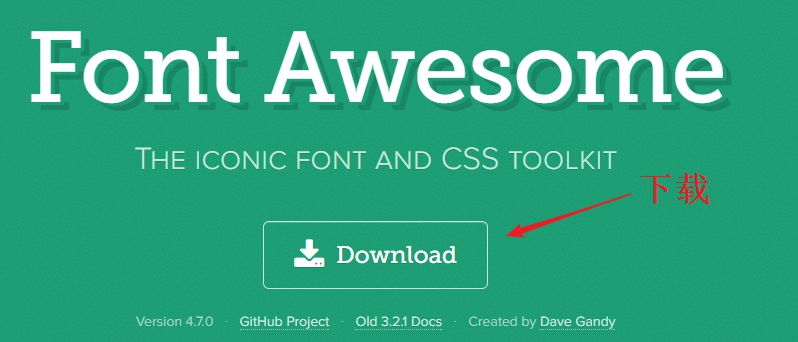
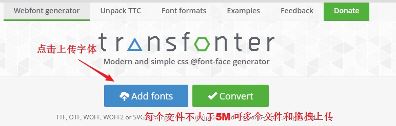
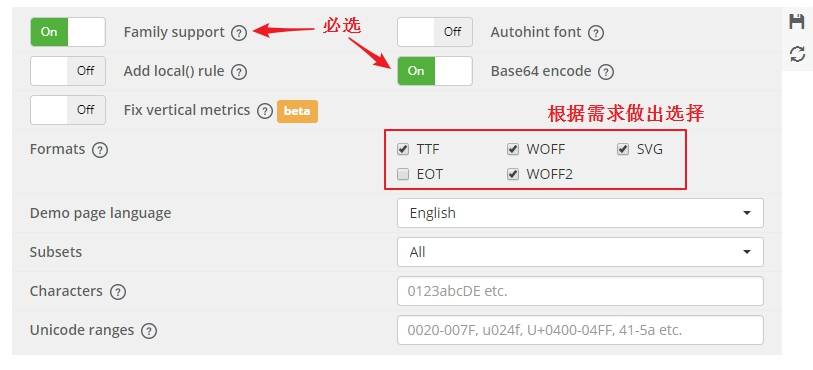
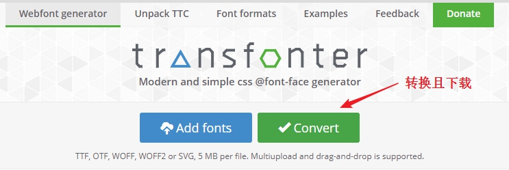
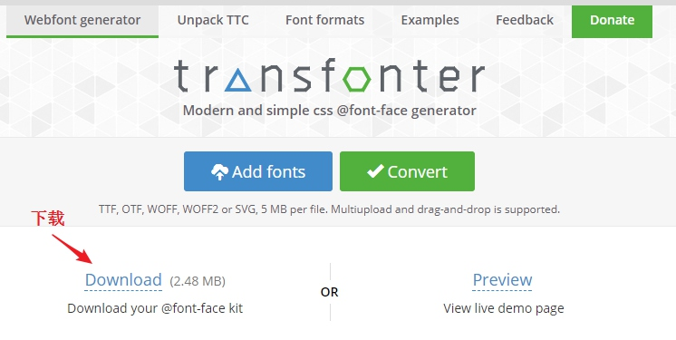

在制作小程序评分组件的时候，觉得如果星形使用图片的话不方便自定义，比如想换个图标、改个颜色等，我就想到使用 [Font Awesome](http://fontawesome.io/)，就跟使用字体一样随心切换。
在使用的过程中发现小程序不支持引用字体文件，无论我是使用绝对路径还是相对路径都会报 404：

在小程序官方我看到了此项注意事项

现在解决方案就明了了，一是将字体文件上传到CDN（不推荐），二是将字体文件转换为 base64，推荐使用 base64。

### 首先下载好所需字体文件
我是下载 [Font Awesome](http://fontawesome.io/)

### 将字体文件转换为 base64
这里推荐一个网站 <https://transfonter.org/>，打开网站后：
上传字体文件

修改配置

配置完后开始转换

下载后解压，我们只需要其中的 `stylesheet.css`，因为转换后的 css 只有@font-face，Font Awesome 的 css 还有其他部分，所以需要合并一下，将合并后的 css 文件进行压缩，压缩后将后缀名改为 `.wxss` 小程序就可以使用了

如果你也是想用 Font Awesome，可在我项目中直接下载 `font-awesome.min.wxss`，免去转换的过程。

参考：<http://www.wxapp-union.com/forum.php?mod=viewthread&tid=1211>

