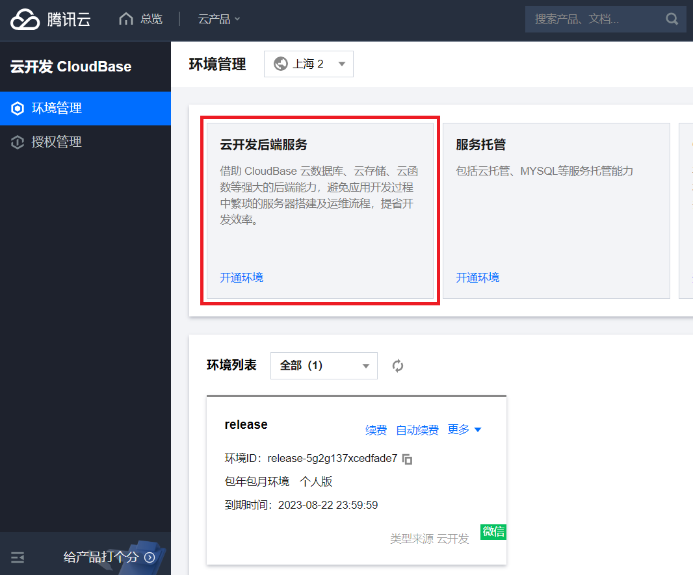
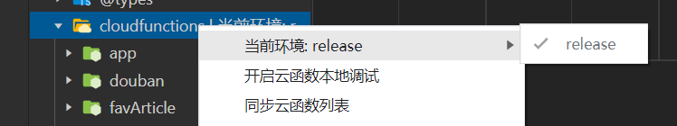
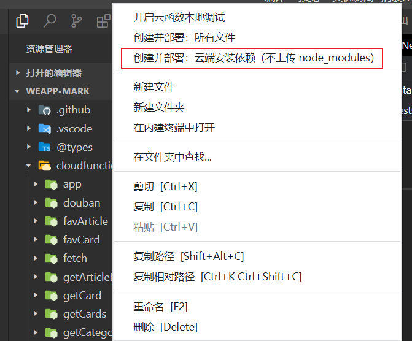
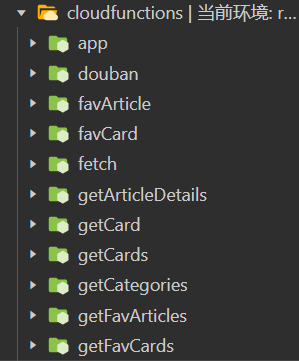

# 云开发环境初始化

## 创建环境

登录腾讯云[云开发控制台](https://console.cloud.tencent.com/tcb/platform/env)

在环境管理创建一个环境，如果已有环境可跳过这一步

可以在网页端的控制台创建环境也可在微信开发者工具的云开发面板创建环境



## 部署云函数

可以使用微信开发者工具部署，也可以使用 CloudBase CLI 部署

微信开发者工具只能逐个部署，但稳

CloudBase CLI 可以批量部署，但可能会出现异常

### 使用微信开发者工具部署

右键项目根目录下 `/cloudfunctions/` 目录选择当前环境



选择 `/cloudfunctions/` 目录下的一级目录创建并部署云函数



### 使用 CloudBase CLI 部署

将项目根目录下的 `/cloudbaserc.json` 中的 `envId` 和 `region` 改为自己的环境 id 和地域

| 地域 | 全称 | 缩写 |
| :--- | :--- | :--- |
| 上海 | `ap-shanghai` | `sh` |
| 广州 | `ap-guangzhou` | `gz` |
| 北京 | `ap-beijing` | `bj` |

```json
{
  "envId": "release-5g2g137xcedfade7",
  "region": "sh"
}
```

全局安装 CloudBase CLI。可选择你喜欢的任意包管理工具，这里使用 pnpm 作为示例

```shell
pnpm add -g @cloudbase/cli
tcb -v
```

执行如下命令通过网页授权登录

```shell
tcb login
```

部署云函数

```shell
tcb fn deploy
```

云函数部署成功后微信开发者工具会显示为绿色



## 初始化集合数据

终端进入 `/cloudfunctions/initdb/` 安装依赖

```shell
pnpm i
```

在微信开发者工具右键目录 `/cloudfunctions/initdb/` 开启云函数本地调试，手动调用一次云函数 `initdb` 即可